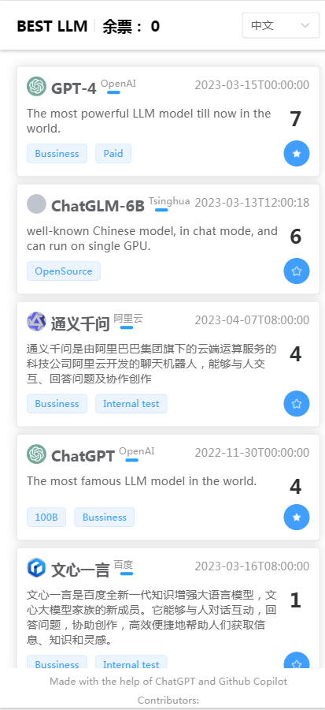

<h1 align="center">Best LLM</h1></br>
<p align="center">|  <a href="README_CN.md">中文版</a> |</p>
<p align="center">
:fire: Vote your favorite LLMs, and see what's the "best" LLM people like. 
</p>

<p align="center">
  <a href="https://llm.best/"><strong>llm.best</strong></a>
</p>
<p align="center">
  <a href="https://opensource.org/licenses/Apache-2.0"></a>
  
    
    
    
</p>

<p align="center">

</p>

## Screenshots
<p align="center">

</p>

## Depoly
1. Clone the repo
```bash
git clone https://github.com/FunnySaltyFish/best_llm
```

2. Install dependencies
```bash
cd best_llm
pip install -r requirements.txt
```

3. Edit `.env` file
```bash
# MongoDB URI, you might need to install mongo first
MONGO_URI = "mongodb://localhost:27017/"
# Whether to enable debug mode, by default it's false
DEBUG = "true"
```

4. Run the server
```bash
# the python version should be >= 3.8
python best_llm.py
```

## Contribute
**THIS PROJECT IS UNDER CONSTRUCTION, CONTRIBUTION IS HIGHLY WELCOME.**

Help us to add more LLMs to the list, or improve the website. 
To **add a new LLM or help improve the relevant information of an existing LLM**, please edit the [llms.json](llms.json) and submit a pull request.

You can also choose to help **improve the website**, including beautifying the UI, adding new features, building CI/CD, re-arranging the code structure, etc. Please submit an issue to discuss before you start, so that we can avoid duplicate work.

## Thanks
- https://github.com/SunLemuria/open_source_chatgpt_list
- https://ailogo.qq.com/ for Logo
- All Contributors
- All the LLMs and their authors
- All the people who voted