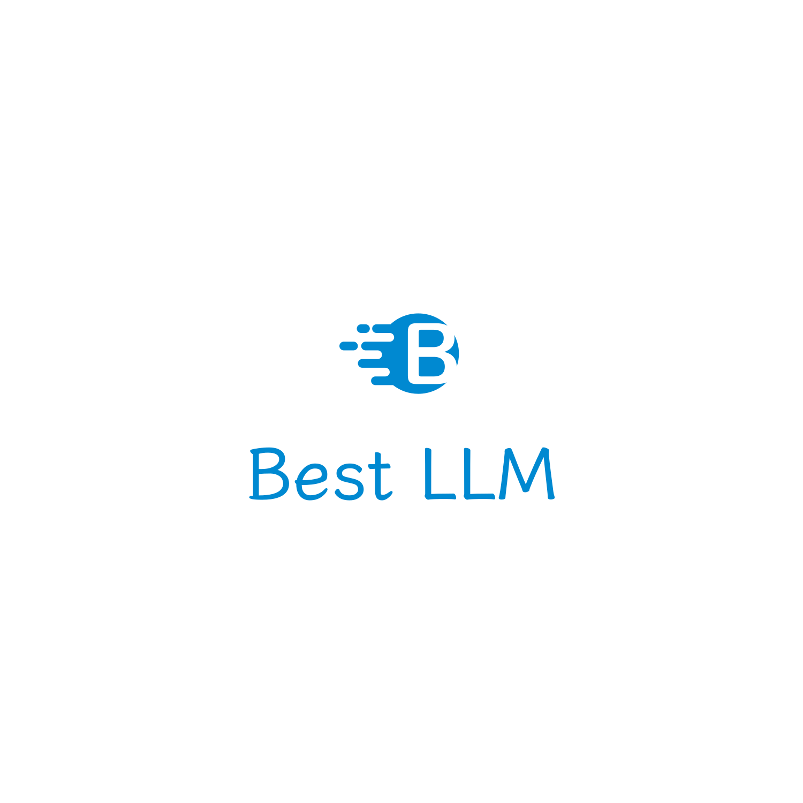

# BestLLM

投票选出你最喜欢的 LLM（大语言模型），并查看人们最喜欢的“最佳” LLM。

**网站地址：**[llm.best](https://llm.best/)

## 贡献

**该项目正在建设中，欢迎贡献。**

帮助我们添加更多的 LLM 到列表中，或者改进网站。 要**添加新的 LLM 或帮助完善和补充现有项目的相关信息**，请编辑 [llms.json](https://chat.openai.com/llms.json) 并提交 PR。

您也可以选择帮助**改进网站**，包括美化UI、添加新功能、构建CI/CD、重新组织代码结构等。在开始之前，请提交一个 issue 供讨论，以避免重复的工作。

## 鸣谢

- https://github.com/SunLemuria/open_source_chatgpt_list
- https://ailogo.qq.com/ 提供Logo
- 所有贡献者
- 所有 LLM 及其作者
- 所有投票的人们